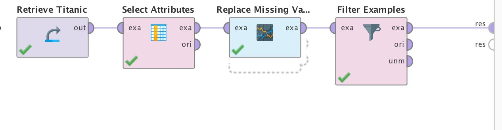
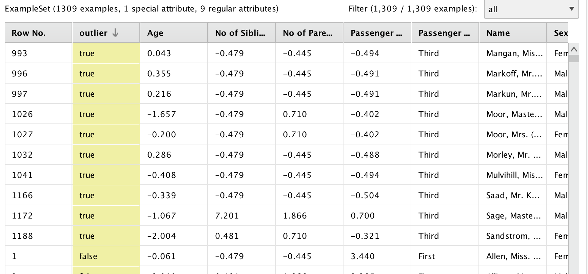

# Supervivencia en el Titanic	

`HERRAMIENTA UTILIZADA: RAPIDMINER`

## Objetivo

Dentro del Pre-procesamiento de datos podemos encontrar dos grandes categorías:
La mezcla y la limpieza.
El objetivo de este trabajo es probar diversas técnicas dentro de éstas categorías.
En este caso, se parte de un conjunto de datos de supervivencia de pasajeros en el Titanic conociendo determinados atributos de los pasajeros.

### Conjunto de datos

Datos correspondientes a 1309 pasajeros

**Clases:**

2 clases: Si o No

**Valores nulos:**
Si

**Outliers:**
Si

**Atributos:**
                
+ Clase del Pasajero
+ Nombre
+ Sexo
+ Edad
+ Numero de ticket
+ Cabina
+ Costo
+ Puerto de embarque
+ Bote Salvavidas
+ **Sobrevive** (Variable Objetivo)

## Tratamiento de Valores Nulos

Como mencionamos anteriormente, parto de un conjunto de datos que cuenta con varios **atributos con valores nulos**.

A continuación voy a proceder a ejecutar diversas acciones para el tratamiento de dichos valores.

Lo primero que voy a hacer es **DESCARTAR** dos atributos del conjunto de datos ya que ambos cuentan con demasiados valores nulos y por lo tanto no me son útiles. 

Descarto entonces:

+ Bote Salvavidas
+ Cabina

> Para descartar utilizo el **operador select attributes** y con el parámetro **subset** filtro todos los atributos menos esos dos.

En el conjunto de datos también tenemos algunos faltantes en el atributo **edad**.

Para resolver esto voy a utilizar otra de las técnicas normalmente usadas: **REEMPLAZAR POR EL PROMEDIO** del resto de los valores.

Reemplazo entonces:

+ Valores nulos de EDAD por valores promedio

> Para reemplazar utilizo el **operador replace missing values**, con parámetro **single** que significa remplazar por el promedio.

Para finalizar, aún me quedan valores nulos pero como se trata de una cantidad muy pequeña y despreciable voy a **DESCARTAR REGISTROS**.

> Para descartar registros, tomo el **operador Filter Examples** y en las opciones avanzadas selecciono **no missing valúes** lo que borra las tuplas sin valores.

## Tratamiento de Outliers

Si bien puede que haya algunos casos para los cuales los valores anómalos o outliers resulten interesantes (como el caso de tarjetas de crédito fraudulentas). En general los outliers son malas mediciones y debemos removerlos.

Para la detección de outilers del conjunto de datos, utilizaremos en este caso un algoritmo basado en distancias, particularmente el [**Algoritmo de Distancias Euclideanas**](./Euclidean.md). Debido al uso de este algoritmo, aquellos atributos con grandes valores contribuirán en mayor medida a la detección de outliers. Además, vamos a necesitar que los valores posean un rango similar (normalización).

Para realizar esto vamos a descartar ciertos atributos que no contribuyen a nuestra búsqueda de outliers.

Descarto entonces:

+ Bote Salvavidas
+ Cabina
+ Número de Ticket

> Para descartar utilizo el **operador select attributes** y con el parámetro **subset** filtro los atributos deseados.

A continuación y como mencionamos **normalizaremos** el conjunto de datos restante, en general este proceso se debe realizar siempre antes de aplicar cualquier algoritmo basado en distancias.

> Para descartar utilizo el **operador normalize**.

Con los datos preparados para la ejecución del algoritmo, realizamos las distancias euclideanas y seleccionamos aquellas que están muy lejos del rango de valores de los datos.

> Para realizar las distancias euclideanas en la detección de outliers utilizo el **operador outlier detection (distances)**.

Como vemos en la imagen, Rapidminer agregó una columna más y nos detectó los 10 (configurable) valores más alejados del conjunto de datos.

[Volver](./../README.md)
