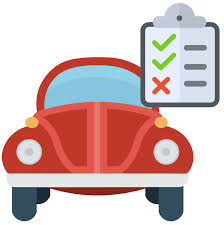

# Evaluación de Autos y Camionetas

## El problema

En el rubro automotor, la oferta de vehículos cero kilómetro es muy amplia y cada vez más accesible convirtiéndose en un mercado cada día más grande.

Así como el mercado crece, crecen las posibilidades en cuanto a marcas y prestaciones.

Cada vehículo a su vez, posee una serie de carcterísticas que lo hacen elegible o no según las necesidades del cliente.

El problema se presenta a la hora de evaluar todas esas características en todas las opciones que el cliente busca.

Se desea poder realizar entonces una evaluación automática del vehículo basándose en las características mencionadas.

[Volver](./../README.md)
