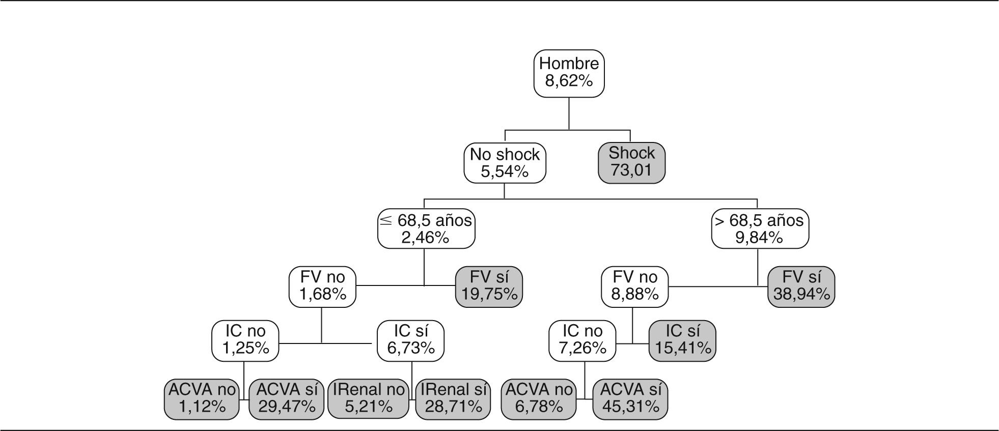

# Árboles de Clasificación y Regresión (CART)

Los árboles de clasificación y regresión CART (Classification And Regression Trees) son una alternativa a métodos de predicción tradicionales tales como la regresión.
Entre las mayores ventajas podemos mencionar que no requiere supuestos sobre los datos por analizar, por lo que requiere de poco esfuerzo en la preparación de los datos, otra de las ventajas son su interpretabilidad y su robustez ante outliers.

Por otra parte, las mayores desventajas vienen por el lado del overfitting. Los árboles de desición pueden ser inestables ante conjuntos de datos con variaciones muy pequeñas.

Se trata de un esquema de múltiples bifurcaciones en forma de árbol, de manera que siguiendo cada una de las ramas, se obtenga al final una predicción de pertenencia (clasificación) o valor que toma (regresión) las variables que cumplen con las propiedades exigidas en cada bifurcación

## Diferencias y similitudes entre los árboles

- Los árboles de regresión se utilizan cuando la variable dependiente es continua
- los árboles de clasificación son utilizados cuando la variable dependiente es categórica
- la regresión utiliza el promedio de los valores
- la clasificación utiliza la moda / clase (el valor con mayor ocurrencias)

## Funcionamiento del algoritmo

[**Véase**](./ejcart.md)

[Volver](./../README.md)
