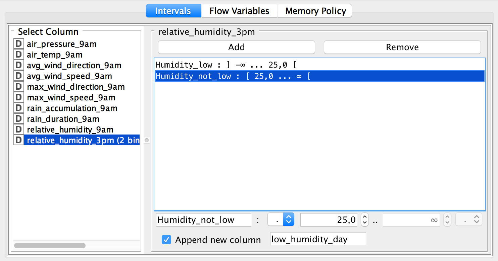
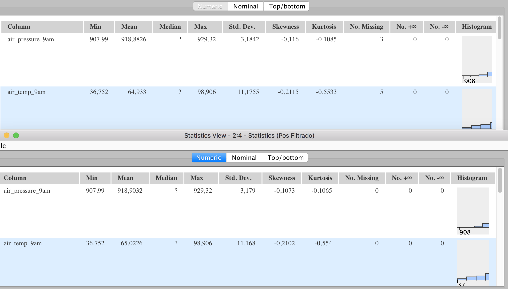
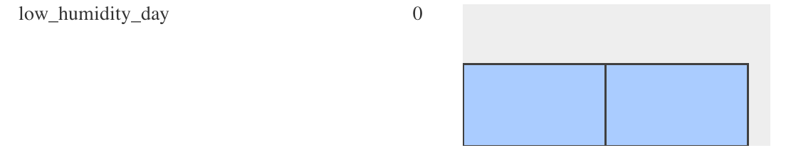
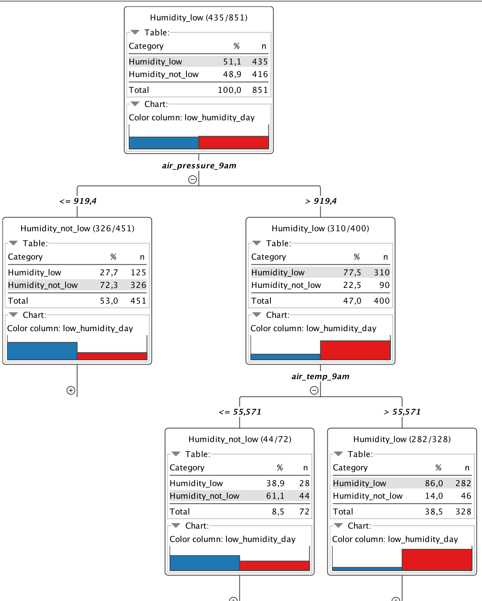
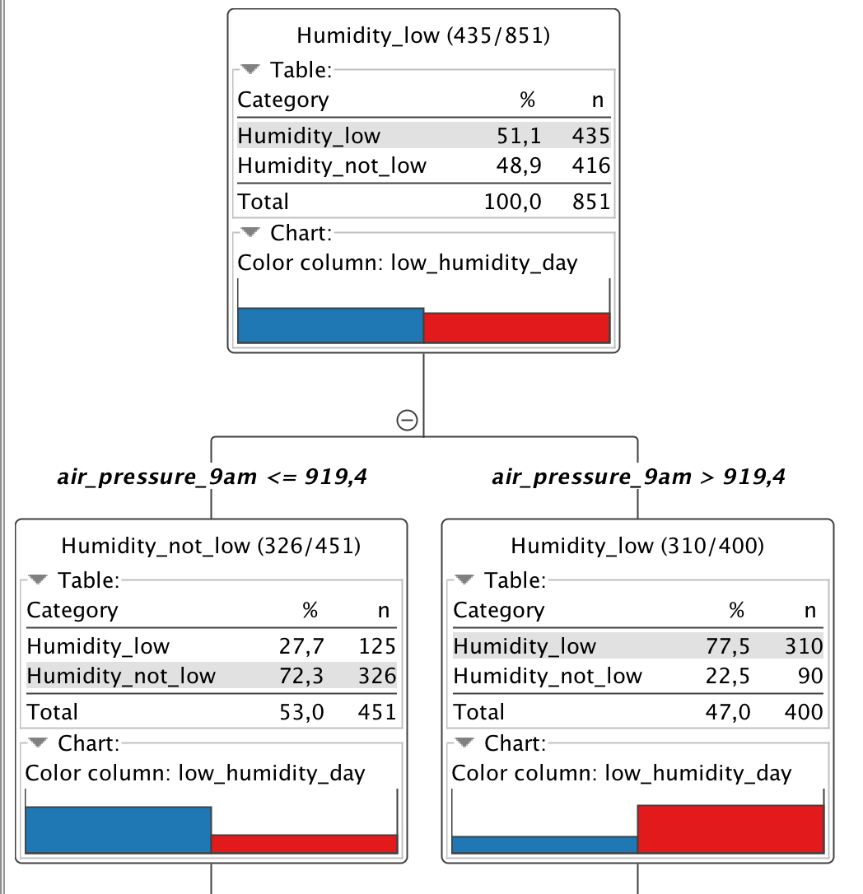
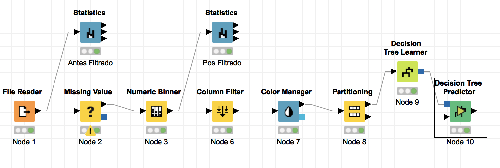

# Ejercicio de aplicación CART: Predicción del Clima

## Herramienta KNIME

KNIME o Konstanz Information Miner por sus siglas es una plataforma de datamining similar a Rapidminer, que permite el desarrollo de modelos en un entorno gráfico.
Está construido bajo la plataforma Eclipse y es una herramienta de software libre por lo cual puede ser descargada y utilizada gratuitamente

## El dataset

Tenemos un conjunto de datos (.csv) compuesto por **1094 mediciones** de variables relacionadas al clima de un día.

Sus atributos son:

- La presión atmosférica en la mañana
- La temperatura en la mañana
- La dirección promedio del viento en la mañana
- La velocidad promedio del viento en la mañana
- La velocidad máxima del viento en la mañana
- La acumulación de lluvia en la mañana
- La humedad relativa en la mañana
- La humedad relativa en la tarde

## Objetivo

El objetivo es determinar si un día cualquiera, será o no un día de baja humedad, dados ciertos parámetros.

## Paso a Paso con KNIME

#### 1- Ingreso de datos

Levanto el archivo .csv utilizando el operador *File Reader*, realizando las configuraciones necesarias (lectura de ids y encabezados, establecer el limitador entre columnas, etc)

#### 2- Manejo de valores nulos

Nuestro dataset tiene para algunas mediciones, valores nulos por lo cual decidimos quitarlos.

Para ello, vamos a utilizar el parámetro *remove row*, del operador *Missing Value*

#### 3- Conversión a variable categórica

Nuestro objetivo es determinar si un día tiene o no baja humedad, sin embargo nuestro conjunto de datos tiene múltiples valores de humedad. Lo que vamos a hacer entonces es "convertir" los valores de humedad en dos *bins* o clases: humedad baja y humedad no baja

Nos valemos del operador *Numeric Biner*: vamos a modificar entonces los valores de la columna humedad relativa en la tarde.

Establecemos el corte entre baja y no baja en 25% y como se vé en la imagen creamos una columna adicional que va a ser nuestra variable objetivo.

Para ver el progreso hasta el momento, vamos a tomar estadísticas conectando el operador *Statistics* con el dataset original y otro luego de los cambios realizados.

Como vemos, originalmente el conjunto de datos poseía valores nulos, ahora ya no.

Además si vamos a las variables nominales en las estadísticas luego de los cambios, podemos observar la nueva columna creada "low humidity", la cual a priori con el corte establecido, tiene una distribución de valores 50-50

#### 4- Filtrado de información

Vamos a usar el operador *Column Filter* para quitar las columnas que tienen que arrojan los datos de humedad, porque es en definitiva lo que queremos predecir.

#### 5- Particion Entrenamiento / Test del dataset

Utilizando el operador *Partitioning* del conjunto de datos vamos a partirlo en una porción para entrenamiento (80%) y la otra para testeo (20%)

#### 6- Entrenamiento con árbol de decisión

Conectamos la salida de datos de 80% que tenemos al momento al operador *Decision Tree Learner*

#### 7- Test y predicción con árbol de decisión

Le pasamos al operador *Decision Tree Predictor* la salida de datos de 20% que tenemos al momento más la salida del árbol de decisión entrenado. Con estos dos conjuntos el operador puede precedir la pertenencia del conjunto de datos a diferentes clases de la variable objetivo.

## Resultados:

En esta primer imagen vemos como quedó el árbol de decisión con el conjunto de entrenamiento (vemos un 50-50) aprox. Se establecieron los colores rojos y azul para las clases baja humedad y no baja humedad respectivamente.

En esta segunda imagen vemos como quedó el árbol de decisión con el conjunto de test basado en el input del árbol de entrenamiento (ya no es tan 50-50). Se estableció la misma escala de colores que el caso anterior.

En ambas imágenes la herramienta permite expandir el árbol siguiendo bifurcaciones basadas en cada atributo.

*El diagrama de bloques utilizado*

