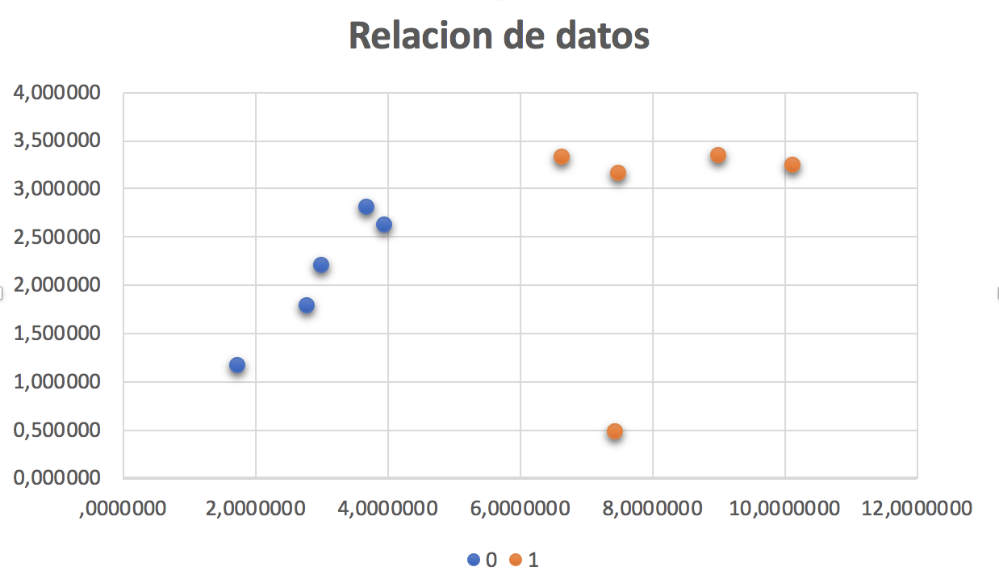

# Ejercicio de aplicación CART

Se tienen dos variables de entrada (X1 yX2) y una sóla variable de salida (Y) con los valores de la siguiente tabla. 

| X1        | X2       | Y |
|-----------|----------|---|
| 2,771245  | 1,784784 | 0 |
| 1,728571  | 1,169761 | 0 |
| 3,678320  | 2,812814 | 0 |
| 3,961043  | 2,619950 | 0 |
| 2,999209  | 2,209014 | 0 |
| 7,497546  | 3,162954 | 1 |
| 9,002203  | 3,339047 | 1 |
| 7,444542  | 0,476683 | 1 |
| 10,124939 | 3,234551 | 1 |
| 6,642287  | 3,319984 | 1 |

[Volver](./../README.md)
