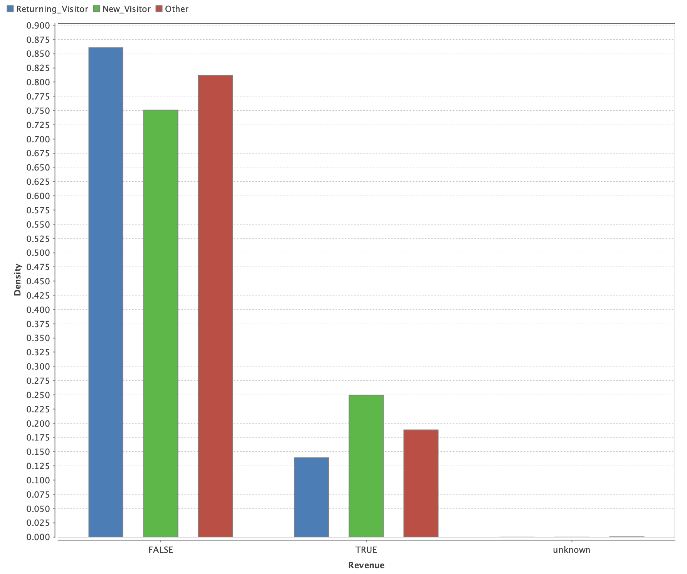
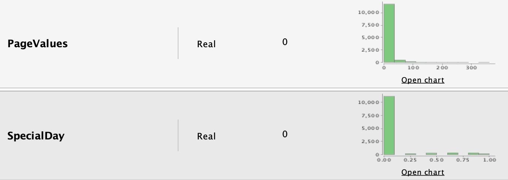

`PROYECTO FINAL`

# ¿Comprando o navegando? Análisis de intención de compra online

- **¿Cuántas veces navegaste por diferentes sitios de e-commerce solo por curiosidad?**
- **¿Qué porcentaje de las veces que observaste un artículo finalmente lo compraste?**
- **¿Cómo pueden predecir las tiendas online, los artículos que los consumidores prefieren?**
- **¿Existe punto de comparación con los curiosos del mundo offline en tiendas físicas?**

Éstas y otras preguntas son las que intentaremos responder y profundizar en este artículo.

Comencemos definiendo **¿Qué es la intención de compra?**:

- Se define como la preferencia del cliente por determinado producto o marca por encima de otros. A efectos de este artículo también manejaremos la intención de compra, como la voluntad del cliente de comprar o no cualquier clase de producto o servicio al navegar por un sitio de e-commerce. Como hablamos de voluntad o intención, esto no se traduce directamente en ventas, por lo cual se tratan como variables diferentes.

#### Analicemos un poco el contexto...

Si hablamos del mundo offline, la intención de compra es un parámetro muy dificil de medir:
- Cómo determino qué busca y cuán dispuesto está un cliente a comprar, cuando ingresa a un negocio?
Una encuesta? Una base de datos de consultas a vendedores? Un registro de llamadas?. Puedo consultar un registro de ventas me estaría adelantando algunos pasos...

Sin embargo, si pasamos al mundo online nos encontramos con un panorama muy diferente:
- Podemos tener registros de links visitados
- Podemos tener registros de búsquedas realizadas
- Podemos medir el tiempo que cada cliente ha pasado mirando un producto / servicio
- Podemos armar campañas y construir una base de datos de interesados

Estamos en condiciones de afirmar entonces, que una de las grandes diferencias del online vs offline es poder medir la inteción de compra.

De hecho según el *"Estudio Global Nielsen sobre Comercio Electrónico"* la intención de los consumidores por utilizar los medios digitales, se viene triplicando año a año, así como también las visitas versus compras efectivas. En la bibliografía de este artículo dejo información que amplía el tema.

También estuve repasando un interesante estudio sobre los factores críticos que influyen en la intención de compra que dejo en la bibliografía.

## El problema

Como ya fue mencionado, la intención de compra es una variable que se puede medir de muchas formas y que también puede tener muchas interpretaciones de acuerdo al tipo de negocio.

Para acortar el alcance, nos enfocaremos en intentar predecir si un cliente que navega por un sitio de compras, terminará efectivamente comprando o no un producto / servicio.

Este problema es super importante entre las tiendas online, ya que el desafío es desarrollar estrategias comerciales, para lograr que ese porcentaje de usuarios que visitaron el sitio sin comprar ningún artículo termine comprando.

A efectos de ciencia de datos, se trata de un problema de aprendizaje supervisado, es decir que el proceso será: a partir de datos conocidos, entrenar diferentes algoritmos, para que puedan predecir nuevos valores.

Está dentro de la categoría "Problemas de Clasificación", ya que nuestro objetivo será clasificar en base a los datos, si algo SUCEDERÁ o NO SUCEDERÁ 

## El Dataset

### Descripción

El conjunto de datos está compuesto por 12330 registros de sesiones en diferentes sitios de comercio electrónico pertenecientes a distintos usuarios.

Cabe destacar que para que el conjunto no tenga tendencia alguna, dichos registros, pertenecen a sesiones durante un periodo de un año para evitar fechas particulares, perfiles particulares de usuarios, etc

Del total de las 12330 sesiones, un 84,5% son ejemplos que NO terminaron en compra alguna, mientras que el restante 15,5% SI.

### Atributos

Cuenta con 18 atributos: 10 atributos numéricos, 8 categóricos.

Algunos de ellos relacionados al usuario como ser:
- Si se trata de un usuario nuevo o es un usuario que retorna (Usuario nuevo o no)
- La región de donde proviene el usuario (1 al 9)

Otros relacionados a la fecha de ingreso:
- Mes de ingreso
- Dia de la semana (Fin de semana o no)
- Si es un día especial (gradualmente ponderado de 0 a 1 con la importancia del día)

También contamos con aspectos técnicos como ser:
- Navegador utilizado
- Sistema operativo

y por último, datos de la sesión como:
- Navegación entre links realizada
- Ratios de salida (desde que ingresó hasta que salió)
- Duración de la sesión según producto

El atributo "Revenue" (Ingreso) será la variable objetivo (si la sesión produjo o no ingreso)

## Paso a paso

Utizaremos en éste análisis, la herramienta RapidMiner para procesar y evaluar los datos

### Pre-Procesamiento: Análisis Primario de los datos

Como primer paso, cargamos los datos y analizamos sus valores y distribución. Notamos que a priori existen, datos faltantes marcados como "cero", atributos que no parecen servir demasiado para el estudio del caso ya que están demasiado centrados en un valor y también valores disparatados o "outliers" en algunos registros

Mediante algunas gráficas podemos ir conociendo relaciones interesantes:

Aquí tenemos dos grandes columnas, quienes efectivamente compraron a la derecha (true) y quienes no a la izquierda (false), en ambas a su vez tenemos 3 valores, según el tipo de usuario, nuevo, conocido y otro.

**Podemos sacar como primer conclusión que la cantidad de usuarios nuevos que realizan una compra, son practicamente el doble de los que compran siendo usuarios ya registrados**

### Pre-Procesamiento: Datos Faltantes

- Encontramos que más del 90% de los valores del atributo *Duración Administrativa de la sesión* son datos faltantes, por lo cual procederemos a quitarlo (*Select Atributes en RM*)

Algo similar ocurre con dos atributos más:

- *Duración de la sesión relacionada con el producto*
- *Duración informada*

### Pre-Procesamiento: Outliers

Encontramos diferentes outliers en los mismos atributos que también poseían datos faltantes y que a los efectos de este análisis, ya fueron eliminados.

### Pre-Procesamiento: Otros atributos a descartar

A continuación observamos las distribuciones de otros dos atributos y podemos notar que practicamente todos los valores están en cero. Inlcuso contrario a lo que a priori se piensa, el atributo special day, no influye en el balance anual de comportamiento de los usuarios.

### Pre-Procesamiento: Unificación de tipos de atributos

Como se trata de un problema de clasificación, necesitamos que los atributos involucrados sean todos del tipo nominal, es decir que tengan una categoría marcada y no diferentes valores numéricos.

Al momento nos quedan 8 atributos numéricos, por tanto vamos a convertirlos a nominales, distribuyendo sus valores en diferentes "bins" o segmentos para poder procesarlos (*Discretize by Binning*).

Elegimos distribuir cada uno de los valores numéricos en 5 diferentes rangos para su clasificación. Luego de este proceso encontramos información de utilidad para seguir puliendo los datos.

Por ejemplo, en algunos atributos, los últimos rangos poseen menos del 1% de los valores comparado con los otros rangos. Por tanto los asumimos como nuevos outliers.

Qué hacemos en este caso? Insertamos un filtro (*filter examples*) inmediatamente antes de la distribución en rangos, **quitando aquellos valores que parecen estar fuera de rango**

## Resultados obtenidos

## Conclusiones

## Bibliografía

- En este artículo podemos encontrar más información sobre el *"Estudio Global Nielsen sobre Comercio Electrónico"* relizado en 2014 https://www.nielsen.com/ec/es/press-room/2014/intenciones-de-compra-online.html. También se puede ampliar en www.nielsen.com

- Artículo sobre los factores críticos que influyen en la intención de compra - http://eprints.uanl.mx/12522/1/A6.pdf

[Volver](./../README.md)
