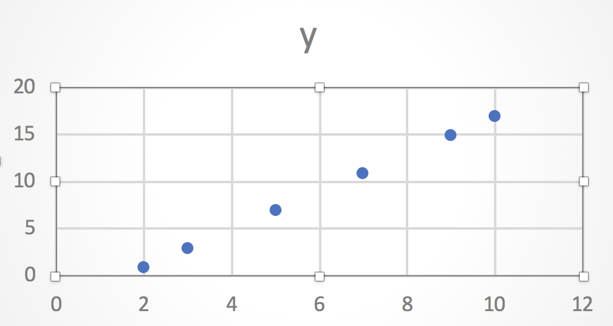

# Record de goles con Regresión Lineal Simple
*Véase* [Regresión Lineal](./../README.md)

A continuación veremos un caso muy sencillo para la aplicación de la regresión lineal:

Un equipo de futbol está jugando una copa, en la cual de llegar hasta la última instancia estaría jugando 13 partidos.

Se llevan jugados 10 partidos y su delantero estrella ha convertido ya 17 goles.

Se desea entonces predecir cuántos goles convertirá al cabo de los 13 partidos (si los jugara) y si alcanzaría el record actual de 21 goles para dicho torneo.

Se tiene el total de goles convertidos **(Y)** luego de jugados **(X)** partidos:

|**PARTIDOS (X)**|**GOLES (Y)**|
|:-:|:-:|
|2|1|
|3|3|
|5|7|
|7|11|
|9|15|
|10|17|
|13|**?**|

Con un sencillo gráfico de dispersión ya puedo notar con claridad la relación lineal de las variables:

A continuación intentaremos deducir la ecuación lineal que define la relación:

Mejoremos entonces la tabla con datos que utilizaremos luego:

|**X**|**Y**|**X.Y**|**x^2**
|:-:|:-:|:-:|:-:
|2|1|2|4
|3|3|9|9
|5|7|35|25
|7|11|77|49
|9|15|135|81
|10|17|170|100
||||
|Σx=36|Σy=54|Σxy=428|Σx^2=268

Siguiendo las fórmulas en **Y = a + bx**

#### B = (n * Σxy - Σx * Σy) / (n * Σx^2 - (Σx)^2)

Substituyendo...

#### B = (6 * 428 - 36 * 54) / (6 * 268 - (36)^2)

#### B = 624 / 312

#### B = 2

Pasamos a la a:

#### A = (Σy / n) - b * (Σx / n)

Substituyendo...

#### A = (54 / 6) - 2 * (36 / 6)

#### A = - 3

## Y = 2x - 3

En nuestro caso estabamos buscando predecir la cantidad de goles (Y), jugados 13 (X) partidos por tanto:

## Y = 2(13) - 3

## Y = 23

## El record será superado!!

[Volver al inicio](./../README.md)
