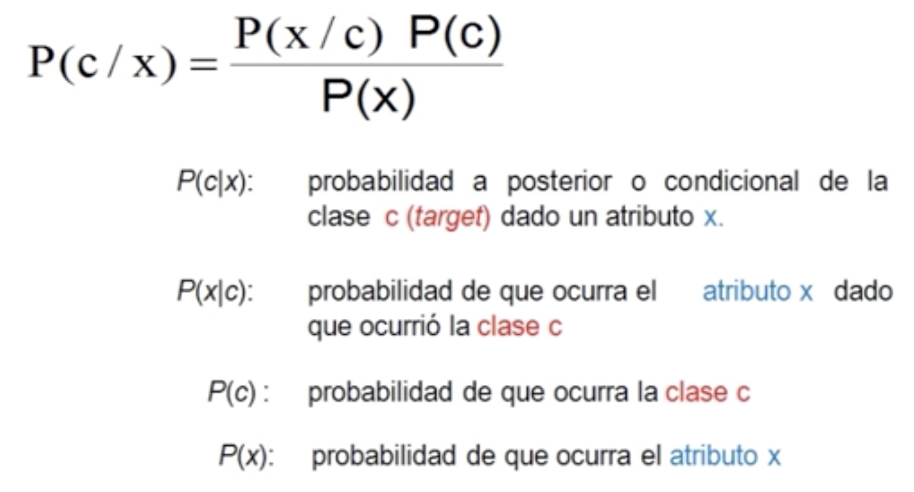

# Naives Bayes

El algoritmo Naives Bayes, es un algoritmo de clasificación no lineal supervisado, es decir que a partir de datos de entrenamiento, realizará predicciones sobre una variable objetivo para determinar si algo efectivamente se cumplirá o no.

Luego evaluaremos dichas predicciones en base a un conjunto de datos de test.

A este algoritmo se le llama clasificador "ingenuo" ya que simplemente realiza cálculos probabilísticos basados en los datos y arroja el resultado, sin una aparente "inteligencia" o captura de patrones.

En términos simples, un clasificador de Bayes ingenuo asume que la presencia o ausencia de una característica particular no está relacionada con la presencia o ausencia de cualquier otra característica, dada la clase variable. Por ejemplo, una fruta puede ser considerada como una manzana si es roja, redonda y de alrededor de 7 cm de diámetro.

**El algoritmo se basa en el teorema de bayes y realiza los cálculos siguiendo la ecuación:**

## Pros

- Fácil
- Rápido
- Especial para tratar con múltiples clases
- Bueno para problemas con variables categóricas

## Contras

- Asume que todos los atributos son independientes entre sí, lo que difiere en la mayoría de los casos con la realidad.

## Ejemplo

Se desea saber si es útil ofrecer una cerveza a un cliente dado que compró Leche.

Se tiene una base de datos con los resultados obtenidos.

| Producto | ¿Cerveza? |
|----------|:---------:|
| Leche    |     NO    |
| Pañales  |     SI    |
| Cigarros |     SI    |
| Leche    |     SI    |
| Leche    |     SI    |
| Pañales  |     SI    |
| Cigarros |     NO    |
| Cigarros |     NO    |
| Leche    |     SI    |
| Cigarros |     SI    |
| Leche    |     NO    |

### Paso 1:

Realizo las tablas de frecuencia con las probabilidades a priori (Ver caso de estudio)

### Paso 2:

Con los datos anteriores utilizando la ecuación del teorema de bayes realizo los cálculos.

Para este ejercicio de ejemplo la probabilidad nos daba 0.6, lo cual representa una probabilidad bastante alta que determina que acciones que busquen la conexión entre leche y cerveza en un supermercado, puedan obtener buenos resultados.

[Volver](./../README.md)

