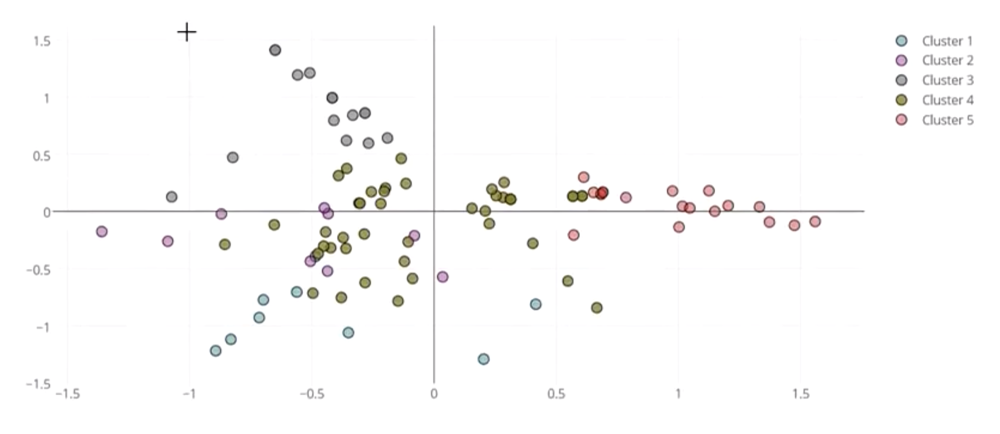

# SmartWatch HealthCare App Sync Evaluation


##  El problema

En este ejemplo se tienen 99 pacientes que monitorean variables de su salud, utilizando una aplicación en un **reloj inteligente** (el ritmo cardíaco, entre otras). El equipo a cargo de esta investigación, les solicita a los pacientes, que sincronicen los datos de la aplicación con bases de datos utilizadas para la investigación. Los datos son tomados continuamente, por lo cual la sincronización también debe ser constante. Vale mencionar que este ejemplo funciona igual que la respuesta de 99 clientes a una campaña de marketing.

Para solicitarles a los pacientes la sincronización de sus datos, se realizan un total de 32 campañas por año, utilizando un medio diferente para cada una como ser:
- Mensajes de texto
- Correos Electrónicos
- Mensajes de Whatsapp
- Carta
- Llamada telefónica
- Etc

Cuando el paciente realiza la sincronización solicitada, se guarda un registro como forma de medir la respuesta a las campañas.

##  El objetivo

El objetivo es entonces agrupar a los pacientes según la campaña a la cual responden, para ajustar los recordatorios para el año próximo.

##  El Dataset

El conjunto de datos es bien sencillo, se trata de un excel con 2 hojas:

La primera enfocada en las campañas con **3 atributos**

- *CampaignID* que identifica cada una de las campañas
- *Type* Tipo o medio por el cual se realizó la campaña
- *Month* Mes en el que se realizó

La segunda enfocada en las respuestas obtenidas con **2 atributos**

- El *id paciente* que identifica de cuál de los 99 pacientes se trata
- La campaña a la cual el paciente respondió (realizó la sincronización que se le pedía) del 1 al 32

##  Paso a Paso

###  Importar herramientas a utilizar

- Librería Pandas
- Librería Numpy
- Librería Sklearn
- Librería plotly (para realizar gráficas)

```from pandas import read_excel, merge
from numpy import arange
from sklearn.cluster import KMeans
from sklearn.decomposition import PCA
import plotly.graph_objs as go
from plotly.offline import init_notebook_mode, iplot
init_notebook_mode()
```

###  Carga y preparación de los datos

Cargamos por un lado los datos sobre las campañas (hoja1) y por otro los datos de las respuestas (hoja2).
Luego y para trabajar sobre un solo conjunto hacemos un merge de ambos conjuntos, sobre el atributo que tienen en común

```
df_campaign = read_excel("PatientResponse.xlsx", sheet_name = 0)
df_response = read_excel("PatientResponse.xlsx", sheet_name = 1)
df_response["n"] = 1
df_campaign.tail()
df_response.tail()
df = merge(df_campaign, df_response, on = "CampaignID")
```

Luego de mezclar, nuestro conjunto de datos quedaría así:

|  | CampaignID | Type | Month  | Patient |  n |
|------------|------|-------------|----------|----|---|
| 319        | 31   | WhatsApp    | December | 99 | 1 |
| 320        | 32   | Long letter | December | 16 | 1 |
| 321        | 32   | Long letter | December | 29 | 1 |
| 322        | 32   | Long letter | December | 46 | 1 |
| 323        | 32   | Long letter | December | 99 | 1 |

a continuación, vamos a crear una matriz para ver qué paciente respondió a cuál campaña y será esa matriz la que utilizaremos como entrada para realizar la división en clusters.

```
table = df.pivot_table(index = ["Patient"], columns = ["CampaignID"], values = "n")
```

Relleno los valores NaN de la matriz con ceros
```
table = table.fillna(0).reset_index()
```

| CampaignID | Patient | 1   | 2   | 3   | 4   | 5   | 6   | 7   | 8   | 9   | ... | 23  | 24  | 25  | 26  | 27  | 28  | 29  | 30  | 31  | 32  |
|------------|---------|-----|-----|-----|-----|-----|-----|-----|-----|-----|-----|-----|-----|-----|-----|-----|-----|-----|-----|-----|-----|
| 91         | 95      | 0.0 | 0.0 | 0.0 | 0.0 | 0.0 | 0.0 | 0.0 | 0.0 | 0.0 | ... | 0.0 | 0.0 | 1.0 | 0.0 | 0.0 | 0.0 | 0.0 | 1.0 | 0.0 | 0.0 |
| 92         | 96      | 0.0 | 0.0 | 0.0 | 0.0 | 0.0 | 0.0 | 0.0 | 1.0 | 0.0 | ... | 0.0 | 0.0 | 0.0 | 0.0 | 0.0 | 0.0 | 0.0 | 1.0 | 1.0 | 0.0 |
| 93         | 97      | 1.0 | 0.0 | 0.0 | 0.0 | 0.0 | 0.0 | 0.0 | 0.0 | 0.0 | ... | 0.0 | 0.0 | 0.0 | 0.0 | 0.0 | 0.0 | 0.0 | 0.0 | 1.0 | 0.0 |
| 94         | 98      | 0.0 | 0.0 | 0.0 | 1.0 | 0.0 | 1.0 | 0.0 | 0.0 | 0.0 | ... | 0.0 | 0.0 | 0.0 | 0.0 | 1.0 | 0.0 | 0.0 | 0.0 | 0.0 | 0.0 |
| 95         | 99      | 0.0 | 0.0 | 0.0 | 0.0 | 0.0 | 1.0 | 0.0 | 0.0 | 1.0 | ... | 0.0 | 0.0 | 0.0 | 0.0 | 0.0 | 0.0 | 0.0 | 0.0 | 1.0 | 1.0 |

###  Predicción en Clusters

Con los datos ya preparados, voy a establecer en un principio 5 clusters diferentes y para cada paciente voy a predecir a cuál de ellos pertenece

```
cluster = KMeans(n_clusters = 5)
table["cluster"] = cluster.fit_predict(table[table.columns[2:]])
```

###  Resultados

A continuación, utilizaremos PCA (Principal Component Analysis) para obtener una gráfica bidimensional

```
pca = PCA(n_components=2)
table['x'] = pca.fit_transform(table[cols])[:,0]
table['y'] = pca.fit_transform(table[cols])[:,1]
table = table.reset_index()
```

Nuestra tabla estaría quedando así:

| CampaignID | index | Patient | 1   | 2   | 3   | 4   | 5   | 6   | 7   | 8   | ... | 26  | 27  | 28  | 29  | 30  | 31  | 32  | cluster | x         | y         |
|------------|-------|---------|-----|-----|-----|-----|-----|-----|-----|-----|-----|-----|-----|-----|-----|-----|-----|-----|---------|-----------|-----------|
| 91         | 91    | 95      | 0.0 | 0.0 | 0.0 | 0.0 | 0.0 | 0.0 | 0.0 | 0.0 | ... | 0.0 | 0.0 | 0.0 | 0.0 | 1.0 | 0.0 | 0.0 | 0       | -0.121409 | -0.437478 |
| 92         | 92    | 96      | 0.0 | 0.0 | 0.0 | 0.0 | 0.0 | 0.0 | 0.0 | 1.0 | ... | 0.0 | 0.0 | 0.0 | 0.0 | 1.0 | 1.0 | 0.0 | 4       | 0.666059  | -0.843051 |
| 93         | 93    | 97      | 1.0 | 0.0 | 0.0 | 0.0 | 0.0 | 0.0 | 0.0 | 0.0 | ... | 0.0 | 0.0 | 0.0 | 0.0 | 0.0 | 1.0 | 0.0 | 3       | -0.474608 | -0.368972 |
| 94         | 94    | 98      | 0.0 | 0.0 | 0.0 | 1.0 | 0.0 | 1.0 | 0.0 | 0.0 | ... | 0.0 | 1.0 | 0.0 | 0.0 | 0.0 | 0.0 | 0.0 | 3       | -0.485692 | -0.393428 |
| 95         | 95    | 99      | 0.0 | 0.0 | 0.0 | 0.0 | 0.0 | 1.0 | 0.0 | 0.0 | ... | 0.0 | 0.0 | 0.0 | 0.0 | 0.0 | 1.0 | 1.0 | 0       | -0.831590 | -1.119408 |


Realizo un merge final para pasar a graficar
```
patient_clusters = table [["Patient", "cluster", "x", "y"]]
final = merge(df_response, patient_clusters)
final = merge(df_campaign, final)
```

### Graficamos



###  Evaluando Resultados

Para concluir, analizamos los resultados de cada cluster, por ejemplo si analizamos el primer cluster (0), obtenemos los siguientes resultados

```
final["0"]= final.cluster == 0
final.groupby("0").Type.value_counts()
```

- WhatsApp 39
- email 15
- Long letter 11
- Telephone 10
- Pamphlet 6
- SMS 2


Vemos que el cluster tiene 49 integrantes, de los cuales, la mayoría realizaron la sincronización de datos que les fue solicitada, ante el recordatorio por Whatsapp.

Sin embargo en el cluster 1 la historia fue diferente:

- email 35
- Whatsapp 1
- Telephone 1
- Pamphlet 1

de estos 38 integrantes, el email fue el método más efectivo.

Podríamos también investigar quiénes fueron esos pacientes para intentar deducir alguna especie de patrón


[Volver](./../README.md)
