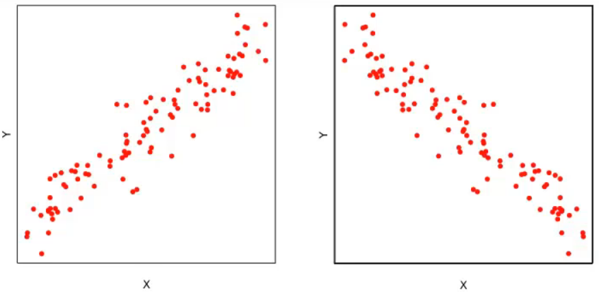
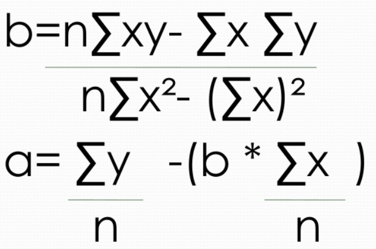
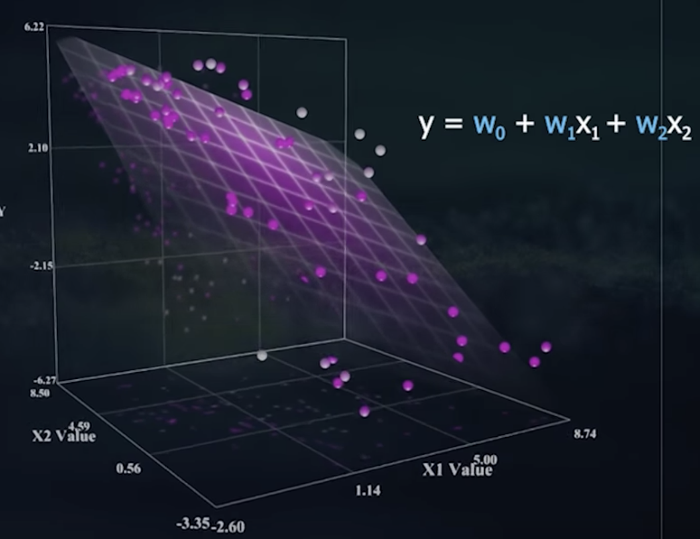

# Regresión Lineal

## Definición

La Regresión Lineal es un modelo de análisis estadístico que nos permite identificar la influencia de una variable X sobre una variable Y de nuestro problema y por consecuencia, establecer predicciones sobre futuros valores de Y, dados nuevos valores de X.

Dado un conjunto de datos de valores de X y su respectivo Y, si graficamos por ejemplo realizando un diagrama de dispersión entre las variables, podemos determinar qué tipo de relación existe entre ellas.

En el caso de la imagen, vemos dos casos en donde podríamos trazar una recta "promedio" entre los puntos.

Sin embargo para determinar con seguridad que se trata de una relacion lineal necesitaríamos también que el [**Coeficiente de correlación**](./coefco.md) de ambas variables sea cercano a 1.

Una vez confirmada la relación lineal entre las variables, ya podemos trazar una línea que se ajuste a todos los puntos de la gráfica. A este procedimiento le llamaremos Regresión Lineal.

## Método de mínimos cuadrados

Siguiendo con el ejemplo mencionado, el método de mínimos cuadrados es un procedimiento que nos permite hallar una línea recta que mejor se adecúe a la relación de las variables.

Lo que éste método intenta realizar es tomar la distancia desde cada punto a la recta buscada y minimizarla. 

Por ser una línea recta, sabemos que tendrá la forma:

#### y = a + bx

Para hallarla necesitaremos conocer también la media de valores de X e Y (mx , my)

Tomando la ecuación **y = a + bx** hallaremos **a** y **b** de la siguiente forma:

Una vez hallados a y b tendremos la ecuación: **y = a + bx** y si quisieramos predecir el próximo valor **x+1** solo restaría modificar la **x** de la ecuación por **x+1** *vease Aplicación Práctica*

## Regresión Lineal Múltiple

Hasta ahora analizamos que a partir de una relación lineal entre dos variables de un problema, podemos predecir futuros valores mediante regresión. Sin embargo en los problemas de la realidad contamos con muchas otras variables que acomplejarían el análisis.

Por ejemplo, si nuestro problema tuviera dos variables, la nueva ecuación sería la siguiente:

#### y = wo + w1 * x1 + w2 * x2

y este caso no se trataría de encontrar una recta se acople a los puntos, sino un plano:

