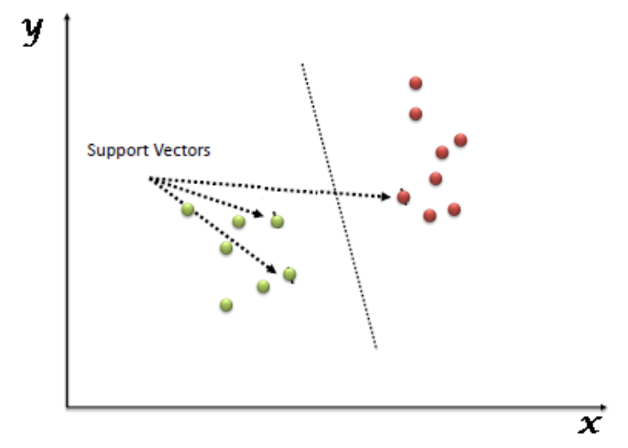
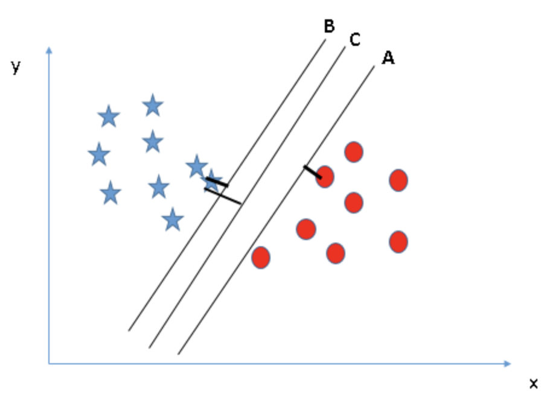

# Support Vector Machines

El Support Vector Machine (SVM) es un modelo supervisado ​​de aprendizaje, es decir que para realizar sus predicciones, es previamente entrenado con información relacionada. Se utiliza tanto para regresión como para la clasificación, aunque es mayormente usado para este último. Es un clasificador no-probabilístico binario (solo escoge entre 2 clases).

En este algoritmo, se realiza un ploteo de cada item del conjunto de datos como un punto en un espacio n-dimensional. Luego, con todos los puntos graficados realizamos una clasificación, encontrando el hiperplano que mejor separa las dos clases, como se ve en la imagen.

Este hiperplano, es la frontera que mejor segrega la diferencia entre ambas clases

## ¿Cómo funciona?

Como mencionamos, el SVM es este hiperplano que mejor divide las clases, la pregunta clave entonces es ¿cómo encontrarlo?

De haber varios hiperplanos ¿cuál elegimos?, veamos algunas condiciones:
- Debe separar ambas clases
- Se debe maximizar la distancia entre el hiperplano y el punto más cercano: a esta distancia se le llama margen (*ver imagen*)

Si bien la regresión puede trabajar de forma eficiente con los datos, es incapaz de manejar datos altamente complejos, tarea para la cual SVM posee un mejor rendimiento.

[Volver](./../README.md)
